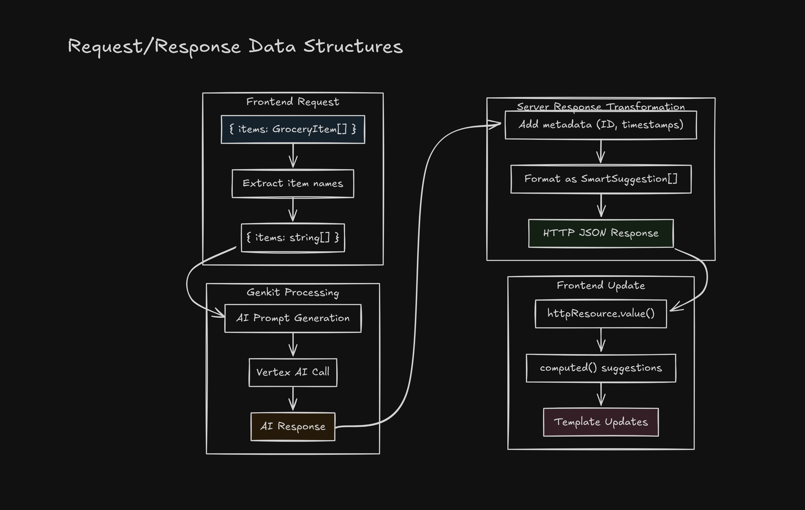

# Build a Smart Grocery Assistant with Angular 20 & AI

> 🎯 **What You'll Build**: A modern grocery list application with AI-powered suggestions using Angular 20's latest features, including signals, new control flow, and Google's Genkit AI framework.

## 🚀 What You'll Learn

- **Angular 20 Features**: Signals for state management, new control flow syntax (`@if`, `@for`), standalone components
- **AI Integration**: Google Genkit with Vertex AI for intelligent item suggestions
- **Modern Patterns**: OnPush change detection, `inject()` function, automatic request cancellation
- **Real-world Application**: Complete CRUD operations with loading states and error handling

## 📋 Prerequisites

- Node.js 18+ installed
- Basic understanding of TypeScript and Angular
- Google Cloud account (required for full AI features)

## 🏁 Final Result Preview

By the end of this tutorial, you'll have a fully functional grocery assistant that:
- ✅ Generates intelligent grocery lists with AI suggestions
- ✅ Allows adding/removing items with real-time AI recommendations  
- ✅ Displays loading states with proper request cancellation
- ✅ Utilizes Angular 20's cutting-edge features

## 🏗️ Architecture Overview

Before we dive into implementation, let's understand how our application is structured:


### Key Components:

- **Home Component**: Main UI component using Angular 20's signals and new control flow
- **Grocery Service**: Manages grocery list state with signals and localStorage persistence
- **AI Assistant Service**: Handles AI suggestions using Angular's new `httpResource()` 
- **Express Server**: Serves the Angular app and provides AI API endpoints
- **Genkit Flow**: Processes AI requests and communicates with Vertex AI
- **Vertex AI**: Google's AI service that generates intelligent grocery suggestions

---

## Step 1: Project Setup & Angular 20 Installation

### Create a New Angular Project

```bash
# Install the latest Angular CLI
npm install -g @angular/cli@latest

# Create a new project with SSR and routing enabled
ng new smart-grocery-assistant --routing --style=css --ssr

# Navigate to the project directory
cd smart-grocery-assistant
```

### Install Required Dependencies

```bash
# Install AI and server dependencies
npm install @genkit-ai/vertexai genkit zod express cors dotenv
npm install --save-dev @types/express @types/cors tsx
```

### Verify Angular 20 Installation

Check your `package.json` file - you should see Angular 20.x:

```json
{
  "dependencies": {
    "@angular/core": "^20.x.x",
    // ... other Angular 20 packages
  }
}
```

---

## Step 2: Environment Configuration

### Create Environment Files

Create a `.env` file in your project's root directory:

```bash
# .env
GOOGLE_GENKIT_ENVIRONMENT=dev
GCLOUD_PROJECT=your-google-cloud-project-id
GCLOUD_LOCATION=us-central1
GOOGLE_APPLICATION_CREDENTIALS=path/to/your/service-account.json
```

### Google Cloud Setup (Optional for Demo)

To enable full AI functionality, follow these steps:

1. Create a Google Cloud Project
2. Enable the Vertex AI API  
3. Create a service account with appropriate permissions
4. Download the credentials JSON file
5. Update the path in your `.env` file

> 💡 **Pro Tip**: The application includes fallback suggestions if Google Cloud isn't configured!

---

## Step 3: TypeScript Interfaces & Models

### Create Type Definitions

Create `src/app/models/grocery.type.ts`:

```typescript
export interface GroceryItem {
  id: string;
  name: string;
  category: GroceryCategory;
  quantity?: number;
  unit?: string;
  createdAt: Date;
  updatedAt: Date;
}

export interface GroceryList {
  id: string;
  name: string;
  items: GroceryItem[];
  createdAt: Date;
  updatedAt: Date;
  isCompleted: boolean;
}

export interface SmartSuggestion {
  item: GroceryItem;
  reason: string;
  priority: 'low' | 'medium' | 'high';
}

export enum GroceryCategory {
  PRODUCE = 'produce',
  DAIRY = 'dairy',
  MEAT = 'meat',
  PANTRY = 'pantry',
  BEVERAGES = 'beverages',
  SNACKS = 'snacks',
  OTHER = 'other',
}

export interface CreateGroceryListRequest {
  includeSuggestions: boolean;
  maxSuggestions?: number;
}
```

### Create Unit Constants

Create `src/app/constants/units.ts`:

```typescript
export interface UnitOption {
  value: string;
  label: string;
}

// Basic unit options for tutorial simplicity
export const UNIT_OPTIONS: UnitOption[] = [
  { value: 'pcs', label: 'pieces' },
  { value: 'lbs', label: 'pounds' },
  { value: 'cups', label: 'cups' },
  { value: 'boxes', label: 'boxes' },
  { value: 'bags', label: 'bags' },
  { value: 'cans', label: 'cans' },
  { value: 'bottles', label: 'bottles' },
];

export function suggestUnitForItem(itemName: string): string {
  const name = itemName.toLowerCase();
  
  // Simple unit suggestions based on common items
  if (name.includes('meat') || name.includes('chicken') || name.includes('beef')) {
    return 'lbs';
  }
  if (name.includes('milk') || name.includes('juice') || name.includes('water')) {
    return 'cups';
  }
  if (name.includes('cereal') || name.includes('pasta') || name.includes('crackers')) {
    return 'boxes';
  }
  if (name.includes('chips') || name.includes('frozen')) {
    return 'bags';
  }
  if (name.includes('soup') || name.includes('beans')) {
    return 'cans';
  }
  if (name.includes('soda')) {
    return 'bottles';
  }
  
  // Default to pieces for countable items
  return 'pcs';
}
```

---

## Step 4: Grocery Service with Angular 20 Signals

### Create the Core Service

Generate the service:

```bash
ng generate service services/grocery
```

Replace `src/app/services/grocery.ts` with:

```typescript
import { Injectable, signal } from '@angular/core';
import { GroceryItem, GroceryList } from '../models/grocery.type';

@Injectable({
  providedIn: 'root',
})
export class Grocery {
  private currentList = signal<GroceryList | null>(null);

  readonly list = this.currentList.asReadonly();

  constructor() {
    this.loadFromStorage();
  }

  // creating a new list
  createNewList(name?: string): GroceryList {
    const newList: GroceryList = {
      id: this.generateId(),
      name: name || `Grocery List - ${new Date().toLocaleDateString()}`,
      items: [],
      createdAt: new Date(),
      updatedAt: new Date(),
      isCompleted: false,
    };

    this.currentList.set(newList);
    this.saveToStorage();

    return newList;
  }

  addItemToCurrentList(item: GroceryItem) {
    const current = this.currentList();
    if (!current) {
      return;
    }
    this.currentList.update((currentList) => {
      const list = currentList as GroceryList;
      const updatedList = {
        ...list,
        items: [...list.items, item],
        updatedAt: new Date(),
      };
      return updatedList;
    });
    this.saveToStorage();
  }

  removeItemFromCurrentList(itemId: string) {
    const current = this.currentList();
    if (!current) {
      return;
    }
    this.currentList.update((currentList) => {
      const list = currentList as GroceryList;
      const updatedList = {
        ...list,
        items: list.items.filter((item) => item.id !== itemId),
        updatedAt: new Date(),
      };
      return updatedList;
    });
    this.saveToStorage();
  }

  loadFromStorage() {
    if (typeof localStorage === 'undefined') return; // for SSR

    try {
      const savedList = localStorage.getItem('grocery_current_list');
      if (savedList) {
        const parsed = JSON.parse(savedList);
        const list = {
          ...parsed,
          createdAt: new Date(parsed.createdAt),
          updatedAt: new Date(parsed.updatedAt),
        };
        this.currentList.set(list);
      }
    } catch (error) {
      console.error('Failed to load from storage', error);
    }
  }

  saveToStorage() {
    if (typeof localStorage === 'undefined') return; // for SSR
    try {
      const currentList = this.currentList();
      if (currentList) {
        localStorage.setItem('grocery_current_list', JSON.stringify(currentList));
      }
    } catch (error) {
      console.error('Failed to save to localStorage', error);
    }
  }

  generateId() {
    return (
      Math.random().toString(36).substring(2, 15) + Math.random().toString(36).substring(2, 15)
    );
  }
}
```

---

## Step 5: AI Assistant Service

### Create the AI Service with `httpResource()`

Generate the AI service:

```bash
ng generate service services/ai-grocery-assistant
```

Replace the contents of `src/app/services/ai-grocery-assistant.ts`:

```typescript
import { Injectable, signal, computed, effect } from '@angular/core';
import { httpResource } from '@angular/common/http';
import { GroceryItem, SmartSuggestion } from '../models/grocery.type';

@Injectable({
  providedIn: 'root',
})
export class AiGroceryAssistant {
  private apiRequest = signal<{ items: GroceryItem[] } | null>(null);

  private smartSuggestionResource = httpResource<SmartSuggestion[]>(() => {
    const request = this.apiRequest();
    if (!request) return undefined;

    return {
      url: '/api/smart-suggestions',
      method: 'POST',
      body: request,
    };
  });

  constructor() {
    effect(() => {
      const request = this.apiRequest();
      if (!request) {
        return;
      }
      this.smartSuggestionResource.reload();
    });
  }

  readonly suggestions = computed(() => {
    const resourceData = this.smartSuggestionResource.value();
    if (!resourceData) return [] as SmartSuggestion[];

    return resourceData as SmartSuggestion[];
  });

  readonly isLoading = this.smartSuggestionResource.isLoading;
  readonly error = this.smartSuggestionResource.error;

  generateSmartSuggestions(groceryItems: GroceryItem[]) {
    this.apiRequest.set({ items: groceryItems });
  }

  clearSuggestions() {
    this.apiRequest.set(null);
  }
}
```

---

## 📊 Data Flow Deep Dive

Let's understand exactly how data flows through our application when generating AI suggestions:


### Key Angular 20 Features in Action:

1. **Signals**: `apiRequest` signal triggers automatic updates
2. **Effects**: `effect()` watches signal changes and triggers HTTP requests
3. **httpResource()**: Manages HTTP state with loading/error signals
4. **Computed**: Automatically recalculates suggestions when data changes

### Data Transformation:


---

## Step 6: Google Genkit AI Integration

### Create Genkit Configuration

Create `src/genkit/index.ts`:

```typescript
import { genkit } from 'genkit';
import * as z from 'zod';
import { vertexAI } from '@genkit-ai/vertexai';

const ai = genkit({
  plugins: [vertexAI()],
});

const outputSchema = z.object({
  suggestions: z.array(
    z.object({
      name: z.string(),
      category: z.string(),
      reason: z.string(),
      priority: z.enum(['low', 'medium', 'high']),
      quantity: z.number().min(1).optional(),
      unit: z.string().optional(),
    }),
  ),
});

export const simpleSuggestionsFlow = ai.defineFlow(
  {
    name: 'simpleSuggestions',
    inputSchema: z.object({
      items: z.array(z.string()).describe('Array of grocery items'),
    }),
    outputSchema: outputSchema,
  },
  async (input) => {
    const prompt = `
    You are a grocery shopping assistant. I have these items in my shopping list:
${input.items.join(', ')}

Please suggest 3-5 additional grocery items that would complement this list. For each suggestion, provide:
- name: the item name
- category: one of (produce, dairy, meat, pantry, beverages, snacks, other)
- reason: why this item is suggested (complementary, essential, healthy, etc.)
- priority: low, medium, or high

Focus on practical, commonly purchased items that make sense with the current list.
  `;
    try {
      const { output } = await ai.generate({
        model: 'vertexai/gemini-2.0-flash',
        prompt,
        output: {
          schema: outputSchema,
        },
      });

      return output || { suggestions: [] };
    } catch (error) {
      console.error('Error generating suggestions with Genkit: ', error);
      return { suggestions: [] };
    }
  },
);

export function initializeGenkit() {
  console.log('Genkit initialized');
}
```

---

## Step 7: Express Server with AI Endpoints

### Update Server Configuration

Replace `src/server.ts`:

```typescript
import {
  AngularNodeAppEngine,
  createNodeRequestHandler,
  isMainModule,
  writeResponseToNodeResponse,
} from '@angular/ssr/node';
import express from 'express';
import { join } from 'node:path';
import cors from 'cors';
import * as dotenv from 'dotenv';
import { initializeGenkit, simpleSuggestionsFlow } from './genkit/index';
import { GroceryItem } from './app/models/grocery.type';

// Load environment variables
dotenv.config();

// Initialize Genkit
initializeGenkit();

const browserDistFolder = join(import.meta.dirname, '../browser');

const app = express();
const angularApp = new AngularNodeAppEngine();

// Enable CORS
app.use(cors());
app.use(express.json());

// 🎯 AI-Powered Smart Suggestions Endpoint
app.post('/api/smart-suggestions', async (req, res) => {
  try {
    const { items } = req.body;

    if (!items || !Array.isArray(items)) {
      return res.status(400).json({ error: 'Invalid items array' });
    }

    const itemNames = (items as GroceryItem[]).map((item) => item.name);

    const result = await simpleSuggestionsFlow({ items: itemNames });

    const suggestions = result.suggestions.map((suggestion) => ({
      item: {
        id: Math.random().toString(36).substring(2),
        name: suggestion.name,
        category: suggestion.category,
        quantity: suggestion.quantity,
        unit: suggestion.unit || 'pcs',
        createdAt: new Date(),
        updatedAt: new Date(),
      },
      reason: suggestion.reason,
      priority: suggestion.priority,
    }));

    return res.json(suggestions);
  } catch (error) {
    console.error('Error generating AI suggestions:', error);

    return res.status(500).json({
      error: 'AI suggestions unavailable',
      message: 'Unable to generate smart suggestions at the moment',
    });
  }
});

/**
 * Serve static files from /browser
 */
app.use(
  express.static(browserDistFolder, {
    maxAge: '1y',
    index: false,
    redirect: false,
  }),
);

/**
 * Handle all other requests by rendering the Angular application.
 */
app.use((req, res, next) => {
  angularApp
    .handle(req)
    .then((response) => (response ? writeResponseToNodeResponse(response, res) : next()))
    .catch(next);
});

/**
 * Start the server if this module is the main entry point.
 */
if (isMainModule(import.meta.url)) {
  const port = process.env['PORT'] || 4000;
  app.listen(port, () => {
    console.log(`Node Express server listening on http://localhost:${port}`);
  });
}

/**
 * Request handler used by the Angular CLI or Firebase Cloud Functions.
 */
export const reqHandler = createNodeRequestHandler(app);
```

---

## 🌐 API Request/Response Flow

Let's examine the detailed API communication between frontend and backend:


### Request/Response Data Structures:



### Error Handling Flow:


---

Update the routes.ts file with the following:

```ts
import { Routes } from '@angular/router';

export const routes: Routes = [
  {
    path: '',
    loadComponent: () => import('./pages/home/home').then(c => c.Home),
    title: 'Smart Grocery Assistant - AI-Powered Shopping Lists'
  },
  {
    path: '**',
    redirectTo: ''
  }
];
```

---

Update the app.config to include the `HttpClient` by using `provideHttpClient` as follows:

```ts
import {
  ApplicationConfig,
  provideBrowserGlobalErrorListeners,
  provideZonelessChangeDetection,
} from '@angular/core';
import { provideRouter } from '@angular/router';

import { routes } from './app.routes';
import { provideClientHydration, withEventReplay } from '@angular/platform-browser';
import { provideHttpClient, withFetch } from '@angular/common/http';

export const appConfig: ApplicationConfig = {
  providers: [
    provideBrowserGlobalErrorListeners(),
    provideZonelessChangeDetection(),
    provideRouter(routes),
    provideClientHydration(withEventReplay()),
    provideHttpClient(withFetch()),
  ],
};
```

---

Update the `index.html` to be as follows:

```html
<!doctype html>
<html lang="en">
<head>
  <meta charset="utf-8">
  <title>Smart Grocery Assistant</title>
  <base href="/">
  <meta name="viewport" content="width=device-width, initial-scale=1">
  <link rel="icon" type="image/x-icon" href="favicon.ico">
</head>
<body>
  <app-root></app-root>
</body>
</html>

```

---

Update the `app.html` as follows:

```html
<header class="app-header">
  <nav class="navbar">
    <div class="nav-brand">
      <a routerLink="/" class="brand-link">
        <span class="brand-icon">🛒</span>
        <span class="brand-text">{{ title() }}</span>
      </a>
    </div>

    <div class="nav-menu">
      <a
        routerLink="/"
        routerLinkActive="active"
        [routerLinkActiveOptions]="{ exact: true }"
        class="nav-link"
        >Dashboard</a
      >
    </div>
  </nav>
</header>

<main class="main-content">
  <router-outlet></router-outlet>
</main>

<footer class="app-footer">
  <div class="footer-content">
    <p>&copy; 2025 Smart Grocery Assistant. Made with 🤖 and Angular</p>
    <div class="footer-links">
      <a href="#" class="footer-link">About</a>
      <a href="#" class="footer-link">Privacy</a>
      <a href="#" class="footer-link">Terms</a>
    </div>
  </div>
</footer>
```

---

Update the `app.ts` file as follows:

```ts
import { Component, signal } from '@angular/core';
import { RouterLink, RouterLinkActive, RouterOutlet } from '@angular/router';

@Component({
  selector: 'app-root',
  imports: [RouterOutlet, RouterLink, RouterLinkActive],
  templateUrl: './app.html',
  styleUrl: './app.css',
})
export class App {
  protected readonly title = signal('smart-grocery-assistant');
}

```

---

## Step 8: Home Component with Angular 20 Features

### Generate Home Component

```bash
ng generate component pages/home
```

### Quick AI Test Setup (Optional)

Before implementing the complete component, let's create a simple test to verify that the AI integration works properly:

Replace the contents of `src/app/pages/home/home.ts` with this test version:

```typescript
import { ChangeDetectionStrategy, Component, inject, signal } from '@angular/core';
import { CommonModule } from '@angular/common';
import { GroceryCategory, GroceryItem } from '../../models/grocery.type';
import { AiGroceryAssistant } from '../../services/ai-grocery-assistant';

@Component({
  selector: 'app-home',
  template: `
    <div class="test-container">
      <h2>AI Test</h2>
      <button (click)="testAI()" [disabled]="isLoading()">
        {{ isLoading() ? 'Loading...' : 'Test AI Suggestions' }}
      </button>

      @if (suggestions().length > 0) {
        <div class="suggestions">
          <h3>AI Suggestions:</h3>
          @for (suggestion of suggestions(); track suggestion.item.id) {
            <div class="suggestion">
              <strong>{{ suggestion.item.name }}</strong>
              ({{ suggestion.item.quantity }} {{ suggestion.item.unit }})
              <br />
              <em>{{ suggestion.reason }}</em>
            </div>
          }
        </div>
      }

      @if (error()) {
        <div class="error">Error: {{ error()?.message }}</div>
      }
    </div>
  `,
  styles: `
    .test-container {
      padding: 2rem;
      max-width: 600px;
      margin: 0 auto;
    }

    button {
      padding: 1rem 2rem;
      font-size: 1rem;
      margin-bottom: 2rem;
    }

    .suggestion {
      border: 1px solid #ddd;
      padding: 1rem;
      margin: 0.5rem 0;
      border-radius: 4px;
    }

    .error {
      color: red;
      padding: 1rem;
      background: #ffe6e6;
      border-radius: 4px;
    }
  `,
  changeDetection: ChangeDetectionStrategy.OnPush,
  imports: [CommonModule],
})
export class Home {
  private aiAssistant = inject(AiGroceryAssistant);

  protected readonly suggestions = this.aiAssistant.suggestions;
  protected readonly isLoading = this.aiAssistant.isLoading;
  protected readonly error = this.aiAssistant.error;

  testAI() {
    // Test with hardcoded grocery items
    const testItems: GroceryItem[] = [
      {
        id: '1',
        name: 'chicken breast',
        category: GroceryCategory.MEAT,
        quantity: 2,
        unit: 'lbs',
        createdAt: new Date(),
        updatedAt: new Date(),
      },
      {
        id: '2',
        name: 'broccoli',
        category: GroceryCategory.VEGETABLES,
        quantity: 1,
        unit: 'bunch',
        createdAt: new Date(),
        updatedAt: new Date(),
      },
    ];

    this.aiAssistant.generateSmartSuggestions(testItems);
  }
}
```

### Test the AI Integration

1. Start your development server:
```bash
npm run dev
```

2. Navigate to `http://localhost:4200`
3. Click the "Test AI Suggestions" button
4. If your Google Cloud setup is correct, you should see AI-generated suggestions

> 💡 **Expected Result**: The AI should suggest complementary items like "rice", "olive oil", or "garlic" based on the chicken and broccoli input.

> ⚠️ **If you get an error**: Make sure your `.env` file is configured correctly and your Google Cloud project has the Vertex AI API enabled. For testing, you can install google cloud CLI [link here], and run `gcloud auth application-default login` which authenticates the CLI with your google account, and sets up your project's credentials in your machine as default application credentials to use.

---

### Update Home Component TypeScript

Replace `src/app/pages/home/home.ts`:

```typescript
import {
  ChangeDetectionStrategy,
  Component,
  signal,
  inject,
  OnDestroy,
} from '@angular/core';
import { CommonModule } from '@angular/common';
import { RouterModule } from '@angular/router';
import { FormsModule } from '@angular/forms';
import { GroceryItem, SmartSuggestion, GroceryCategory } from '../../models/grocery.type';
import { UNIT_OPTIONS, suggestUnitForItem } from '../../constants/units';
import { Grocery } from '../../services/grocery';
import { AiGroceryAssistant } from '../../services/ai-grocery-assistant';

@Component({
  selector: 'app-home',
  templateUrl: './home.html',
  styleUrl: './home.css',
  // 🎯 Angular 20 Feature: OnPush change detection for better performance
  changeDetection: ChangeDetectionStrategy.OnPush,
  // 🎯 Angular 20 Feature: Standalone components (no modules needed!)
  imports: [CommonModule, RouterModule, FormsModule],
})
export class Home implements OnDestroy {
  // 🎯 Angular 20 Feature: inject() function instead of constructor injection
  private groceryService = inject(Grocery);
  private aiAssistant = inject(AiGroceryAssistant);

  // 🎯 Angular 20 Feature: Signals for reactive state management
  protected readonly isGeneratingList = signal(false);

  // 🎯 Angular 20 Feature: Using resource-based AI service signals
  protected readonly aiSuggestions = this.aiAssistant.suggestions;
  protected readonly isLoadingAISuggestions = this.aiAssistant.isLoading;
  protected readonly aiError = this.aiAssistant.error;

  protected readonly showSuggestions = signal(false);

  // Manual item entry signals
  protected readonly newItemName = signal('');
  protected readonly newItemQuantity = signal('');
  protected readonly newItemUnit = signal('');
  protected readonly isAddingItem = signal(false);

  // Unit options for dropdowns
  protected readonly unitOptions = UNIT_OPTIONS;

  // 🎯 Angular 20 Feature: Readonly signals from service
  protected readonly currentList = this.groceryService.list;

  onGenerateGroceryList(): void {
    this.isGeneratingList.set(true);

    try {
      // Create a new list if none exists
      if (!this.currentList()) {
        this.groceryService.createNewList('Smart List - ' + new Date().toLocaleDateString());
      }

      // Get AI suggestions for the current list
      this.refreshSuggestions();
    } catch (error) {
      console.error('Failed to generate grocery list:', error);
    } finally {
      this.isGeneratingList.set(false);
    }
  }

  addSuggestionToList(suggestion: SmartSuggestion): void {
    // Ensure there's a current list
    if (!this.currentList()) {
      this.groceryService.createNewList();
    }

    this.groceryService.addItemToCurrentList(suggestion.item);

    // Refresh suggestions based on updated list
    // This will trigger the AI service to generate new suggestions
    this.refreshSuggestions();
  }

  removeItemFromList(itemId: string): void {
    this.groceryService.removeItemFromCurrentList(itemId);
    this.refreshSuggestions();
  }

  addManualItem(): void {
    const name = this.newItemName().trim();
    if (!name) return;

    this.isAddingItem.set(true);

    // Ensure there's a current list
    if (!this.currentList()) {
      this.groceryService.createNewList();
    }

    const suggestedUnit = this.newItemUnit() || suggestUnitForItem(name);

    const newItem: GroceryItem = {
      id: this.generateId(),
      name,
      category: this.categorizeItem(name),
      quantity: this.newItemQuantity() ? parseInt(this.newItemQuantity()) : undefined,
      unit: suggestedUnit || undefined,
      createdAt: new Date(),
      updatedAt: new Date(),
    };

    this.groceryService.addItemToCurrentList(newItem);

    // Clear form
    this.newItemName.set('');
    this.newItemQuantity.set('');
    this.newItemUnit.set('');
    this.isAddingItem.set(false);

    // Refresh suggestions
    this.refreshSuggestions();
  }

  refreshSuggestions(): void {
    const currentList = this.currentList();
    if (!currentList) return;

    // 🎯 Angular 20 Feature: Use resource-based AI service for all suggestions
    this.aiAssistant.generateSmartSuggestions(currentList.items);

    // The suggestions will be automatically updated via the aiSuggestions signal
    // which is computed from the httpResource in the AI service
    this.showSuggestions.set(true);
  }

  protected updateSuggestionQuantity(suggestion: SmartSuggestion, event: Event): void {
    const target = event.target as HTMLInputElement;
    const quantity = parseInt(target.value) || 1;
    suggestion.item.quantity = quantity;
  }

  protected updateSuggestionUnit(suggestion: SmartSuggestion, event: Event): void {
    const target = event.target as HTMLSelectElement;
    suggestion.item.unit = target.value || undefined;
  }

  getSuggestionIcon(reason: string): string {
    switch (reason) {
      case 'running_low':
        return '⚠️';
      case 'regular_purchase':
        return '🔄';
      case 'seasonal':
        return '🌟';
      case 'complementary':
        return '🤝';
      default:
        return '💡';
    }
  }

  getPriorityClass(priority: string): string {
    switch (priority) {
      case 'high':
        return 'priority-high';
      case 'medium':
        return 'priority-medium';
      default:
        return 'priority-low';
    }
  }

  private categorizeItem(itemName: string): GroceryCategory {
    const name = itemName.toLowerCase();

    if (['apple', 'banana', 'carrot', 'lettuce', 'tomato'].some((p) => name.includes(p))) {
      return GroceryCategory.PRODUCE;
    }
    if (['milk', 'cheese', 'yogurt', 'butter'].some((d) => name.includes(d))) {
      return GroceryCategory.DAIRY;
    }
    if (['chicken', 'beef', 'pork'].some((m) => name.includes(m))) {
      return GroceryCategory.MEAT;
    }
    if (['pasta', 'rice', 'bread', 'flour'].some((p) => name.includes(p))) {
      return GroceryCategory.PANTRY;
    }
    if (['soda', 'juice', 'water', 'beer'].some((b) => name.includes(b))) {
      return GroceryCategory.BEVERAGES;
    }
    if (['chips', 'cookies', 'crackers'].some((s) => name.includes(s))) {
      return GroceryCategory.SNACKS;
    }

    return GroceryCategory.OTHER;
  }

  ngOnDestroy(): void {
    // 🎯 Angular 20 Feature: httpResource() handles cleanup automatically
    this.aiAssistant.clearSuggestions();
  }

  private generateId(): string {
    return Math.random().toString(36).substring(2, 15);
  }
}
```

---

## 🔄 Component Interaction Flow

Here's how the Angular 20 components and services interact with each other:


### Angular 20 Signal Flow:

1. **User Interaction**: Button clicks, form inputs
2. **Signal Updates**: `signal.set()` or `signal.update()` 
3. **Automatic Reactions**: `effect()` watches signals and triggers side effects
4. **Service Integration**: Services use `inject()` instead of constructor injection
5. **Template Updates**: New control flow (`@if`, `@for`) reacts to signal changes

### State Management Pattern:


### Update Home Component Template

Replace `src/app/pages/home/home.html`:

```html
<div class="hero-section">
  <div class="hero-content">
    <h1>🛒 Smart Grocery Assistant</h1>
    <p class="hero-subtitle">AI-powered grocery planning made simple</p>
    <p class="hero-description">
      Press the button below to generate a smart grocery list with AI suggestions
    </p>
    <div class="hero-actions">
      <button 
        class="primary-button" 
        (click)="onGenerateGroceryList()" 
        [disabled]="isGeneratingList()"
      >
        <!-- 🎯 Angular 20 Feature: New control flow syntax @if -->
        @if (isGeneratingList()) {
          <div class="button-spinner"></div>
          Generating suggestions...
        } @else {
          🛒 Generate Smart List
        }
      </button>
    </div>
  </div>
</div>

<!-- 🎯 Angular 20 Feature: New control flow @if instead of *ngIf -->
@if (currentList()) {
  <section class="current-list-section">
    <div class="container">
      <h2>📋 Your Shopping List</h2>
      <div class="list-card">
        <div class="list-header">
          <h3>{{ currentList()!.name }}</h3>
          <span class="item-count">{{ currentList()!.items.length }} items</span>
        </div>
        <div class="grocery-items">
          <!-- 🎯 Angular 20 Feature: New control flow @for instead of *ngFor -->
          @for (item of currentList()!.items; track item.id) {
            <div class="grocery-item">
              <div class="item-info">
                <span class="item-name">{{ item.name }}</span>
                <span class="item-category">{{ item.category }}</span>
                @if (item.quantity) {
                  <span class="item-quantity">{{ item.quantity }} {{ item.unit || '' }}</span>
                }
              </div>
              <button class="remove-button" (click)="removeItemFromList(item.id)">❌</button>
            </div>
          }
        </div>
        
        <!-- Add Item Form -->
        <div class="add-item-form">
          <h4>Add Item</h4>
          <div class="form-row">
            <input 
              type="text" 
              placeholder="Item name" 
              [(ngModel)]="newItemName"
              class="item-input"
              (keyup.enter)="addManualItem()"
            />
            <input 
              type="number" 
              placeholder="Qty" 
              [(ngModel)]="newItemQuantity"
              class="quantity-input"
              (keyup.enter)="addManualItem()"
            />
            <select [(ngModel)]="newItemUnit" class="unit-input">
              <option value="">Unit</option>
              @for (unit of unitOptions; track unit.value) {
                <option [value]="unit.value">{{ unit.label }}</option>
              }
            </select>
            <button 
              class="add-button" 
              (click)="addManualItem()" 
              [disabled]="!newItemName().trim() || isAddingItem()"
            >
              @if (isAddingItem()) {
                <div class="spinner-small"></div>
              } @else {
                ➕
              }
            </button>
          </div>
        </div>
      </div>
    </div>
  </section>
}

@if (showSuggestions() || isLoadingAISuggestions()) {
  <section class="suggestions-section">
    <div class="container">
      <h2>💡 Smart Suggestions</h2>
      
      @if (isLoadingAISuggestions()) {
        <div class="suggestions-loading">
          <div class="loading-spinner"></div>
          <p>🤖 AI is analyzing your list and generating smart suggestions...</p>
        </div>
      } @else if (aiSuggestions().length > 0) {
        <div class="suggestions-grid">
          @for (suggestion of aiSuggestions(); track suggestion.item.id) {
            <div class="suggestion-card" [class]="getPriorityClass(suggestion.priority)">
              <div class="suggestion-header">
                <span class="suggestion-icon">{{ getSuggestionIcon(suggestion.reason) }}</span>
                <div class="suggestion-info">
                  <h4>{{ suggestion.item.name }}</h4>
                  <p class="suggestion-reason">{{ suggestion.reason | titlecase }}</p>
                  <p class="suggestion-priority">{{ suggestion.priority | titlecase }} priority</p>
                  @if (suggestion.item.quantity && suggestion.item.unit) {
                    <p class="suggestion-quantity">{{ suggestion.item.quantity }} {{ suggestion.item.unit }}</p>
                  }
                </div>
              </div>
              <div class="suggestion-actions">
                <div class="quantity-controls">
                  <input 
                    type="number" 
                    [value]="suggestion.item.quantity || 1" 
                    (input)="updateSuggestionQuantity(suggestion, $event)"
                    min="1" 
                    class="quantity-input-small"
                  />
                  <select 
                    [value]="suggestion.item.unit || ''"
                    (change)="updateSuggestionUnit(suggestion, $event)"
                    class="unit-select-small"
                  >
                    <option value="">Unit</option>
                    @for (unit of unitOptions; track unit.value) {
                      <option [value]="unit.value">{{ unit.label }}</option>
                    }
                  </select>
                </div>
                <button class="add-suggestion-button" (click)="addSuggestionToList(suggestion)">
                  Add to List
                </button>
              </div>
            </div>
          }
        </div>
      } @else {
        <div class="no-suggestions">
          <p>No suggestions available at the moment.</p>
        </div>
      }
    </div>
  </section>
}

@if (!currentList()) {
  <section class="welcome-section">
    <div class="container">
      <div class="welcome-card">
        <h2>🎉 Welcome to Smart Grocery Assistant!</h2>
        <p>Start by generating your first smart grocery list or add items manually.</p>
        
        <!-- Quick Start Form -->
        <div class="quick-start-form">
          <h3>Add Your First Item</h3>
          <div class="form-row">
            <input 
              type="text" 
              placeholder="What do you need to buy?" 
              [(ngModel)]="newItemName"
              class="item-input-large"
              (keyup.enter)="addManualItem()"
            />
            <button 
              class="add-button-large" 
              (click)="addManualItem()" 
              [disabled]="!newItemName().trim() || isAddingItem()"
            >
              @if (isAddingItem()) {
                <div class="spinner-small"></div> Adding...
              } @else {
                Add to List
              }
            </button>
          </div>
        </div>
        
        <div class="welcome-tips">
          <h3>Getting Started:</h3>
          <ul>
            <li>Click "Generate Smart List" to get AI-powered suggestions</li>
            <li>Add items manually using the form above</li>
            <li>The AI will suggest complementary items as you build your list</li>
          </ul>
        </div>
      </div>
    </div>
  </section>
}
```

---

## Step 9: Styling the Application

### Add Component Styles

Choose one of the following styles.

#### Style 1

Update `src/app/pages/home/home.css`:

```css
.hero-section {
  background: linear-gradient(135deg, #27ae60 0%, #16a085 100%);
  color: white;
  padding: 4rem 2rem;
  text-align: center;
  margin-bottom: 4rem;
}

.hero-content {
  max-width: 800px;
  margin: 0 auto;
}

.hero-section h1 {
  font-size: 3.5rem;
  font-weight: 700;
  margin-bottom: 1rem;
  text-shadow: 2px 2px 4px rgba(0, 0, 0, 0.1);
}

.hero-subtitle {
  font-size: 1.5rem;
  font-weight: 300;
  margin-bottom: 1.5rem;
  opacity: 0.95;
}

.hero-description {
  font-size: 1.1rem;
  line-height: 1.6;
  margin-bottom: 2.5rem;
  opacity: 0.9;
  max-width: 600px;
  margin-left: auto;
  margin-right: auto;
}

.hero-actions {
  display: flex;
  gap: 1rem;
  justify-content: center;
  flex-wrap: wrap;
}

.primary-button {
  padding: 1.2rem 2.5rem;
  border-radius: 12px;
  font-weight: 600;
  font-size: 1.1rem;
  background: white;
  color: #27ae60;
  border: none;
  cursor: pointer;
  display: flex;
  align-items: center;
  gap: 0.5rem;
  transition: all 0.3s ease;
  box-shadow: 0 4px 15px rgba(0, 0, 0, 0.1);
}

.primary-button:hover:not(:disabled) {
  transform: translateY(-2px);
  box-shadow: 0 6px 20px rgba(0, 0, 0, 0.15);
}

.primary-button:disabled {
  opacity: 0.7;
  cursor: not-allowed;
  transform: none;
}

.button-spinner {
  width: 20px;
  height: 20px;
  border: 2px solid #27ae60;
  border-top: 2px solid transparent;
  border-radius: 50%;
  animation: spin 1s linear infinite;
}

.container {
  max-width: 1200px;
  margin: 0 auto;
  padding: 0 2rem;
}

.current-list-section {
  margin-bottom: 4rem;
}

.list-card {
  background: white;
  border-radius: 16px;
  box-shadow: 0 4px 20px rgba(0, 0, 0, 0.1);
  overflow: hidden;
}

.list-header {
  background: linear-gradient(135deg, #f8f9fa 0%, #e9ecef 100%);
  padding: 2rem;
  border-bottom: 1px solid #dee2e6;
  display: flex;
  justify-content: space-between;
  align-items: center;
}

.list-header h3 {
  margin: 0;
  color: #2c3e50;
  font-size: 1.5rem;
}

.item-count {
  background: #27ae60;
  color: white;
  padding: 0.5rem 1rem;
  border-radius: 20px;
  font-size: 0.9rem;
  font-weight: 600;
}

.grocery-items {
  padding: 1.5rem;
}

.grocery-item {
  display: flex;
  justify-content: space-between;
  align-items: center;
  padding: 1rem 0;
  border-bottom: 1px solid #f0f0f0;
}

.grocery-item:last-child {
  border-bottom: none;
}

.item-info {
  display: flex;
  gap: 1rem;
  align-items: center;
  flex: 1;
}

.item-name {
  font-weight: 600;
  color: #2c3e50;
  font-size: 1.1rem;
}

.item-category {
  background: #e9ecef;
  color: #6c757d;
  padding: 0.25rem 0.75rem;
  border-radius: 12px;
  font-size: 0.8rem;
  text-transform: capitalize;
}

.item-quantity {
  color: #27ae60;
  font-weight: 600;
  font-size: 0.9rem;
}

.remove-button {
  background: none;
  border: none;
  cursor: pointer;
  padding: 0.5rem;
  border-radius: 50%;
  transition: all 0.2s ease;
}

.remove-button:hover {
  background: #fee;
  transform: scale(1.1);
}

.add-item-form {
  background: #f8f9fa;
  padding: 2rem;
  border-top: 1px solid #dee2e6;
}

.add-item-form h4 {
  margin: 0 0 1rem 0;
  color: #2c3e50;
}

.form-row {
  display: flex;
  gap: 1rem;
  align-items: center;
  flex-wrap: wrap;
}

.item-input, .quantity-input, .unit-input {
  padding: 0.75rem;
  border: 2px solid #e9ecef;
  border-radius: 8px;
  font-size: 1rem;
  transition: border-color 0.2s ease;
}

.item-input {
  flex: 1;
  min-width: 200px;
}

.quantity-input {
  width: 80px;
}

.unit-input {
  width: 120px;
}

.item-input:focus, .quantity-input:focus, .unit-input:focus {
  outline: none;
  border-color: #27ae60;
}

.add-button {
  padding: 0.75rem 1.5rem;
  background: #27ae60;
  color: white;
  border: none;
  border-radius: 8px;
  cursor: pointer;
  display: flex;
  align-items: center;
  gap: 0.5rem;
  font-weight: 600;
  transition: all 0.2s ease;
}

.add-button:hover:not(:disabled) {
  background: #219a52;
  transform: translateY(-1px);
}

.add-button:disabled {
  opacity: 0.6;
  cursor: not-allowed;
  transform: none;
}

.suggestions-section {
  margin-bottom: 4rem;
}

.suggestions-section h2 {
  text-align: center;
  color: #2c3e50;
  margin-bottom: 2rem;
  font-size: 2rem;
}

.suggestions-loading {
  text-align: center;
  padding: 3rem 1rem;
  color: #666;
}

.suggestions-loading .loading-spinner {
  margin: 0 auto 1rem;
  width: 50px;
  height: 50px;
  border-width: 4px;
}

.suggestions-loading p {
  font-size: 1.1rem;
  font-style: italic;
  margin: 0;
}

.no-suggestions {
  text-align: center;
  padding: 3rem 1rem;
  color: #999;
  font-style: italic;
}

.suggestions-grid {
  display: grid;
  grid-template-columns: repeat(auto-fit, minmax(300px, 1fr));
  gap: 1.5rem;
}

.suggestion-card {
  background: white;
  border-radius: 12px;
  padding: 1.5rem;
  box-shadow: 0 2px 10px rgba(0, 0, 0, 0.1);
  border-left: 4px solid #ddd;
  transition: all 0.2s ease;
}

.suggestion-card:hover {
  transform: translateY(-2px);
  box-shadow: 0 4px 20px rgba(0, 0, 0, 0.15);
}

.suggestion-card.priority-high {
  border-left-color: #e74c3c;
}

.suggestion-card.priority-medium {
  border-left-color: #f39c12;
}

.suggestion-card.priority-low {
  border-left-color: #95a5a6;
}

.suggestion-header {
  display: flex;
  gap: 1rem;
  margin-bottom: 1rem;
}

.suggestion-icon {
  font-size: 1.5rem;
}

.suggestion-info h4 {
  margin: 0 0 0.5rem 0;
  color: #2c3e50;
  font-size: 1.2rem;
}

.suggestion-reason, .suggestion-priority {
  margin: 0.25rem 0;
  font-size: 0.9rem;
  color: #6c757d;
}

.suggestion-actions {
  margin-top: 1rem;
  display: flex;
  flex-direction: column;
  gap: 0.75rem;
}

.quantity-controls {
  display: flex;
  gap: 0.5rem;
  align-items: center;
}

.quantity-input-small {
  width: 60px;
  padding: 0.4rem;
  border: 1px solid #ddd;
  border-radius: 4px;
  font-size: 0.8rem;
  text-align: center;
}

.unit-select-small {
  flex: 1;
  padding: 0.4rem;
  border: 1px solid #ddd;
  border-radius: 4px;
  font-size: 0.8rem;
  background: white;
}

.suggestion-quantity {
  color: #7f8c8d;
  font-size: 0.85rem;
  margin: 0.25rem 0 0 0;
  font-weight: 500;
}

.add-suggestion-button {
  background: #27ae60;
  color: white;
  border: none;
  padding: 0.5rem 1rem;
  border-radius: 6px;
  cursor: pointer;
  font-size: 0.9rem;
  transition: background 0.2s;
  width: 100%;
}

.add-suggestion-button:hover {
  background: #229954;
}

.welcome-section {
  text-align: center;
  padding: 4rem 2rem;
}

.welcome-card {
  background: white;
  border-radius: 16px;
  padding: 3rem;
  box-shadow: 0 4px 20px rgba(0, 0, 0, 0.1);
  max-width: 600px;
  margin: 0 auto;
}

.welcome-card h2 {
  color: #2c3e50;
  margin-bottom: 1rem;
}

.quick-start-form {
  margin: 2rem 0;
}

.item-input-large {
  padding: 1rem;
  border: 2px solid #e9ecef;
  border-radius: 8px;
  font-size: 1.1rem;
  width: 100%;
  max-width: 300px;
  margin-right: 1rem;
}

.add-button-large {
  padding: 1rem 2rem;
  background: #27ae60;
  color: white;
  border: none;
  border-radius: 8px;
  cursor: pointer;
  font-weight: 600;
  font-size: 1.1rem;
  display: inline-flex;
  align-items: center;
  gap: 0.5rem;
}

.welcome-tips {
  text-align: left;
  margin-top: 2rem;
}

.welcome-tips h3 {
  color: #2c3e50;
  margin-bottom: 1rem;
}

.welcome-tips ul {
  color: #6c757d;
  line-height: 1.6;
}

.spinner-small {
  width: 16px;
  height: 16px;
  border: 2px solid white;
  border-top: 2px solid transparent;
  border-radius: 50%;
  animation: spin 1s linear infinite;
}

.loading-spinner {
  width: 40px;
  height: 40px;
  border: 3px solid #f0f0f0;
  border-top: 3px solid #27ae60;
  border-radius: 50%;
  animation: spin 1s linear infinite;
}

@keyframes spin {
  0% { transform: rotate(0deg); }
  100% { transform: rotate(360deg); }
}

/* Responsive Design */
@media (max-width: 768px) {
  .hero-section h1 {
    font-size: 2.5rem;
  }
  
  .form-row {
    flex-direction: column;
    align-items: stretch;
  }
  
  .item-input-large {
    margin-right: 0;
    margin-bottom: 1rem;
    max-width: none;
  }
  
  .suggestions-grid {
    grid-template-columns: 1fr;
  }
}
```

---

#### Style 2

Update the `home.css` file as:

```css
.hero-section {
  background: linear-gradient(135deg, #27ae60 0%, #16a085 100%);
  color: white;
  padding: 4rem 2rem;
  text-align: center;
  margin-bottom: 4rem;
}

.hero-content {
  max-width: 800px;
  margin: 0 auto;
}

.hero-section h1 {
  font-size: 3.5rem;
  font-weight: 700;
  margin-bottom: 1rem;
  text-shadow: 2px 2px 4px rgba(0, 0, 0, 0.1);
}

.hero-subtitle {
  font-size: 1.5rem;
  font-weight: 300;
  margin-bottom: 1.5rem;
  opacity: 0.95;
}

.hero-description {
  font-size: 1.1rem;
  line-height: 1.6;
  margin-bottom: 2.5rem;
  opacity: 0.9;
  max-width: 600px;
  margin-left: auto;
  margin-right: auto;
}

.hero-actions {
  display: flex;
  gap: 1rem;
  justify-content: center;
  flex-wrap: wrap;
}

.primary-button {
  padding: 1.2rem 2.5rem;
  border-radius: 12px;
  font-weight: 600;
  font-size: 1.1rem;
  background: white;
  color: #27ae60;
  border: none;
  cursor: pointer;
  transition: all 0.3s ease;
  display: flex;
  align-items: center;
  gap: 0.5rem;
}

.primary-button:hover:not(:disabled) {
  background: #f8f9fa;
  transform: translateY(-2px);
  box-shadow: 0 8px 25px rgba(255, 255, 255, 0.2);
}

.primary-button:disabled {
  opacity: 0.8;
  cursor: not-allowed;
}

.button-spinner {
  width: 18px;
  height: 18px;
  border: 2px solid #27ae60;
  border-top: 2px solid transparent;
  border-radius: 50%;
  animation: spin 1s linear infinite;
}

.container {
  max-width: 1200px;
  margin: 0 auto;
  padding: 0 2rem;
}

/* Stats Section */
.stats-section {
  padding: 3rem 0;
  background: #f8f9fa;
}

.stats-section h2 {
  text-align: center;
  font-size: 2.2rem;
  color: #2c3e50;
  margin-bottom: 2rem;
}

.stats-grid {
  display: grid;
  grid-template-columns: repeat(auto-fit, minmax(200px, 1fr));
  gap: 1.5rem;
  margin-bottom: 2rem;
}

.stat-card {
  background: white;
  padding: 1.5rem;
  border-radius: 12px;
  text-align: center;
  box-shadow: 0 2px 8px rgba(0, 0, 0, 0.1);
  transition: transform 0.2s ease;
}

.stat-card:hover {
  transform: translateY(-2px);
}

.stat-icon {
  font-size: 2rem;
  margin-bottom: 0.5rem;
}

.stat-card h3 {
  color: #27ae60;
  font-size: 1.8rem;
  margin-bottom: 0.5rem;
  font-weight: 700;
}

.stat-card p {
  color: #7f8c8d;
  font-size: 0.9rem;
}

/* Current List Section */
.current-list-section {
  padding: 3rem 0;
}

.current-list-section h2 {
  font-size: 2.2rem;
  color: #2c3e50;
  margin-bottom: 2rem;
}

.list-card {
  background: white;
  border-radius: 12px;
  box-shadow: 0 4px 12px rgba(0, 0, 0, 0.1);
  overflow: hidden;
}

.list-header {
  background: #27ae60;
  color: white;
  padding: 1.5rem 2rem;
  display: flex;
  justify-content: space-between;
  align-items: center;
}

.list-header h3 {
  margin: 0;
  font-size: 1.3rem;
}

.item-count {
  background: rgba(255, 255, 255, 0.2);
  padding: 0.3rem 0.8rem;
  border-radius: 20px;
  font-size: 0.9rem;
}

.grocery-items {
  padding: 1rem 0;
}

.grocery-item {
  display: flex;
  justify-content: space-between;
  align-items: center;
  padding: 0.8rem 2rem;
  border-bottom: 1px solid #ecf0f1;
}

.grocery-item:last-child {
  border-bottom: none;
}

.item-info {
  display: flex;
  flex-direction: column;
  gap: 0.2rem;
}

.item-name {
  font-weight: 600;
  color: #2c3e50;
}

.item-category {
  font-size: 0.8rem;
  color: #7f8c8d;
  text-transform: capitalize;
}

.item-quantity {
  font-size: 0.9rem;
  color: #27ae60;
  font-weight: 500;
}

.remove-button {
  background: none;
  border: none;
  cursor: pointer;
  padding: 0.5rem;
  border-radius: 50%;
  transition: background 0.2s;
}

.remove-button:hover {
  background: #ffebee;
}

/* Suggestions Section */
.suggestions-section {
  padding: 3rem 0;
  background: #f8f9fa;
}

.suggestions-section h2 {
  text-align: center;
  font-size: 2.2rem;
  color: #2c3e50;
  margin-bottom: 2rem;
}

.suggestions-grid {
  display: grid;
  grid-template-columns: repeat(auto-fill, minmax(280px, 1fr));
  gap: 1.5rem;
}

.suggestion-card {
  background: white;
  border-radius: 12px;
  padding: 1.5rem;
  box-shadow: 0 2px 8px rgba(0, 0, 0, 0.1);
  border-left: 4px solid #bdc3c7;
  transition: transform 0.2s ease;
}

.suggestion-card:hover {
  transform: translateY(-2px);
}

.suggestion-card.priority-high {
  border-left-color: #e74c3c;
}

.suggestion-card.priority-medium {
  border-left-color: #f39c12;
}

.suggestion-card.priority-low {
  border-left-color: #27ae60;
}

.suggestion-header {
  display: flex;
  gap: 1rem;
  margin-bottom: 1rem;
}

.suggestion-icon {
  font-size: 1.5rem;
}

.suggestion-info h4 {
  margin: 0 0 0.3rem 0;
  color: #2c3e50;
  font-size: 1.1rem;
}

.suggestion-reason {
  font-size: 0.8rem;
  color: #7f8c8d;
  margin: 0;
  text-transform: capitalize;
}

.suggestion-confidence {
  font-size: 0.8rem;
  color: #27ae60;
  margin: 0;
  font-weight: 500;
}

.suggestion-actions {
  margin-top: 1rem;
  display: flex;
  flex-direction: column;
  gap: 0.75rem;
}

.quantity-controls {
  display: flex;
  gap: 0.5rem;
  align-items: center;
}

.quantity-input-small {
  width: 60px;
  padding: 0.4rem;
  border: 1px solid #ddd;
  border-radius: 4px;
  font-size: 0.8rem;
  text-align: center;
}

.unit-select-small {
  flex: 1;
  padding: 0.4rem;
  border: 1px solid #ddd;
  border-radius: 4px;
  font-size: 0.8rem;
  background: white;
}

.suggestion-quantity {
  color: #7f8c8d;
  font-size: 0.85rem;
  margin: 0.25rem 0 0 0;
  font-weight: 500;
}

.add-suggestion-button {
  background: #27ae60;
  color: white;
  border: none;
  padding: 0.5rem 1rem;
  border-radius: 6px;
  cursor: pointer;
  font-size: 0.9rem;
  transition: background 0.2s;
  width: 100%;
}

.add-suggestion-button:hover {
  background: #229954;
}

/* Cooking Section */
.cooking-section {
  padding: 3rem 0;
}

.cooking-section h2 {
  text-align: center;
  font-size: 2.2rem;
  color: #2c3e50;
  margin-bottom: 2rem;
}

.recipes-grid {
  display: grid;
  grid-template-columns: repeat(auto-fill, minmax(320px, 1fr));
  gap: 2rem;
}

.recipe-card {
  background: white;
  border-radius: 12px;
  padding: 1.5rem;
  box-shadow: 0 4px 12px rgba(0, 0, 0, 0.1);
  border-top: 4px solid #e67e22;
}

.recipe-header {
  margin-bottom: 1rem;
}

.recipe-header h4 {
  margin: 0 0 0.5rem 0;
  color: #2c3e50;
  font-size: 1.2rem;
}

.recipe-meta {
  display: flex;
  gap: 1rem;
  font-size: 0.9rem;
}

.difficulty {
  color: #7f8c8d;
}

.match {
  color: #e67e22;
  font-weight: 500;
}

.recipe-details {
  margin-bottom: 1rem;
}

.recipe-details p {
  margin: 0.3rem 0;
  font-size: 0.9rem;
  color: #7f8c8d;
}

.missing-ingredients {
  border-top: 1px solid #ecf0f1;
  padding-top: 1rem;
}

.missing-ingredients h5 {
  margin: 0 0 0.5rem 0;
  color: #e74c3c;
  font-size: 0.9rem;
}

.missing-list {
  display: flex;
  flex-wrap: wrap;
  gap: 0.5rem;
  margin-bottom: 1rem;
}

.missing-ingredient {
  background: #ffebee;
  color: #e74c3c;
  padding: 0.2rem 0.5rem;
  border-radius: 4px;
  font-size: 0.8rem;
}

.add-missing-button {
  background: #e67e22;
  color: white;
  border: none;
  padding: 0.5rem 1rem;
  border-radius: 6px;
  cursor: pointer;
  font-size: 0.8rem;
  transition: background 0.2s;
}

.add-missing-button:hover {
  background: #d35400;
}

/* History Section */
.history-section {
  padding: 3rem 0;
  background: #f8f9fa;
}

.history-section h2 {
  text-align: center;
  font-size: 2.2rem;
  color: #2c3e50;
  margin-bottom: 2rem;
}

.history-grid {
  display: grid;
  grid-template-columns: repeat(auto-fill, minmax(250px, 1fr));
  gap: 1.5rem;
}

.purchase-card {
  background: white;
  border-radius: 12px;
  padding: 1.5rem;
  box-shadow: 0 2px 8px rgba(0, 0, 0, 0.1);
}

.purchase-header {
  display: flex;
  justify-content: space-between;
  align-items: center;
  margin-bottom: 0.5rem;
}

.purchase-header h4 {
  margin: 0;
  color: #2c3e50;
  font-size: 1.1rem;
}

.purchase-cost {
  color: #27ae60;
  font-weight: 600;
}

.purchase-store {
  color: #7f8c8d;
  font-size: 0.9rem;
  margin: 0.3rem 0;
}

.purchase-items {
  color: #7f8c8d;
  font-size: 0.9rem;
  margin: 0;
}

/* Add Item Form */
.add-item-form {
  border-top: 1px solid #ecf0f1;
  padding: 1.5rem 2rem;
  background: #f8f9fa;
}

.add-item-form h4 {
  margin: 0 0 1rem 0;
  color: #2c3e50;
  font-size: 1.1rem;
}

.form-row {
  display: flex;
  gap: 0.5rem;
  align-items: center;
}

.item-input {
  flex: 1;
  padding: 0.7rem;
  border: 1px solid #ddd;
  border-radius: 8px;
  font-size: 1rem;
}

.quantity-input {
  width: 70px;
  padding: 0.7rem;
  border: 1px solid #ddd;
  border-radius: 8px;
  font-size: 1rem;
}

.unit-input {
  width: 80px;
  padding: 0.7rem;
  border: 1px solid #ddd;
  border-radius: 8px;
  font-size: 1rem;
  background: white;
  cursor: pointer;
}

.add-button {
  background: #27ae60;
  color: white;
  border: none;
  padding: 0.7rem 1rem;
  border-radius: 8px;
  cursor: pointer;
  font-size: 1rem;
  display: flex;
  align-items: center;
  gap: 0.3rem;
  transition: background 0.2s;
}

.add-button:hover:not(:disabled) {
  background: #229954;
}

.add-button:disabled {
  opacity: 0.6;
  cursor: not-allowed;
}

.spinner-small {
  width: 16px;
  height: 16px;
  border: 2px solid #ffffff;
  border-top: 2px solid transparent;
  border-radius: 50%;
  animation: spin 1s linear infinite;
}

/* Quick Start Form */
.quick-start-form {
  background: rgba(255, 255, 255, 0.1);
  border-radius: 12px;
  padding: 2rem;
  margin: 2rem 0;
}

.quick-start-form h3 {
  margin-bottom: 1rem;
  color: white;
  text-align: center;
}

.item-input-large {
  flex: 1;
  padding: 1rem;
  border: 1px solid rgba(255, 255, 255, 0.3);
  border-radius: 8px;
  font-size: 1.1rem;
  background: rgba(255, 255, 255, 0.9);
  color: #2c3e50;
}

.item-input-large::placeholder {
  color: #7f8c8d;
}

.add-button-large {
  background: #2ecc71;
  color: white;
  border: none;
  padding: 1rem 1.5rem;
  border-radius: 8px;
  cursor: pointer;
  font-size: 1.1rem;
  font-weight: 600;
  display: flex;
  align-items: center;
  gap: 0.5rem;
  transition: background 0.2s;
  white-space: nowrap;
}

.add-button-large:hover:not(:disabled) {
  background: #27ae60;
}

.add-button-large:disabled {
  opacity: 0.6;
  cursor: not-allowed;
}

/* Welcome Section */
.welcome-section {
  padding: 4rem 0;
}

.welcome-card {
  background: linear-gradient(135deg, #3498db, #2980b9);
  color: white;
  border-radius: 16px;
  padding: 3rem 2rem;
  text-align: center;
  box-shadow: 0 8px 32px rgba(52, 152, 219, 0.3);
}

.welcome-card h2 {
  margin-bottom: 1rem;
  font-size: 2rem;
}

.welcome-card > p {
  font-size: 1.1rem;
  margin-bottom: 2rem;
  opacity: 0.9;
}

.welcome-tips {
  background: rgba(255, 255, 255, 0.1);
  border-radius: 12px;
  padding: 2rem;
  text-align: left;
  max-width: 600px;
  margin: 0 auto;
}

.welcome-tips h3 {
  margin-bottom: 1rem;
  color: white;
}

.welcome-tips ul {
  list-style: none;
  padding: 0;
}

.welcome-tips li {
  padding: 0.5rem 0;
  padding-left: 1.5rem;
  position: relative;
  line-height: 1.5;
}

.welcome-tips li:before {
  content: '✓';
  position: absolute;
  left: 0;
  color: #2ecc71;
  font-weight: bold;
}

@keyframes spin {
  to {
    transform: rotate(360deg);
  }
}

@media (max-width: 768px) {
  .hero-section {
    padding: 2rem 1rem;
  }
  
  .hero-section h1 {
    font-size: 2.5rem;
  }
  
  .hero-subtitle {
    font-size: 1.2rem;
  }
  
  .primary-button {
    padding: 1rem 1.5rem;
    font-size: 1rem;
  }
  
  .stats-grid {
    grid-template-columns: repeat(2, 1fr);
  }
  
  .suggestions-grid,
  .recipes-grid,
  .history-grid {
    grid-template-columns: 1fr;
  }
  
  .grocery-item {
    padding: 0.8rem 1rem;
  }
  
  .item-info {
    flex-direction: row;
    gap: 0.5rem;
    align-items: center;
  }
  
  .welcome-tips {
    text-align: center;
  }
  
  .form-row {
    flex-direction: column;
    gap: 0.8rem;
  }
  
  .item-input,
  .quantity-input,
  .unit-input,
  .item-input-large {
    width: 100%;
  }
  
  .add-button,
  .add-button-large {
    width: 100%;
    justify-content: center;
  }
  
  .add-item-form {
    padding: 1rem;
  }
  
  .quick-start-form .form-row {
    flex-direction: column;
  }
}

/* Modal Styles */
.modal-overlay {
  position: fixed;
  top: 0;
  left: 0;
  width: 100%;
  height: 100%;
  background-color: rgba(0, 0, 0, 0.5);
  display: flex;
  justify-content: center;
  align-items: center;
  z-index: 1000;
}

.modal-content {
  background: white;
  border-radius: 16px;
  padding: 0;
  min-width: 400px;
  max-width: 90vw;
  max-height: 90vh;
  box-shadow: 0 20px 40px rgba(0, 0, 0, 0.2);
  animation: modalSlideIn 0.3s ease-out;
}

@keyframes modalSlideIn {
  from {
    opacity: 0;
    transform: translateY(-50px) scale(0.95);
  }
  to {
    opacity: 1;
    transform: translateY(0) scale(1);
  }
}

.modal-header {
  display: flex;
  justify-content: space-between;
  align-items: center;
  padding: 1.5rem 2rem;
  border-bottom: 1px solid #e8f5e8;
  background: linear-gradient(135deg, #27ae60 0%, #16a085 100%);
  color: white;
  border-radius: 16px 16px 0 0;
}

.modal-header h3 {
  margin: 0;
  font-size: 1.3rem;
  font-weight: 600;
}

.modal-close {
  background: none;
  border: none;
  color: white;
  font-size: 1.5rem;
  cursor: pointer;
  padding: 0.5rem;
  border-radius: 50%;
  transition: background-color 0.2s;
}

.modal-close:hover {
  background-color: rgba(255, 255, 255, 0.1);
}

.modal-body {
  padding: 2rem;
}

.item-preview {
  display: flex;
  align-items: center;
  gap: 1rem;
  margin-bottom: 1.5rem;
  padding: 1rem;
  background: #f8fdf8;
  border-radius: 8px;
}

.item-preview h4 {
  margin: 0;
  font-size: 1.1rem;
  color: #27ae60;
}

.item-category-badge {
  background: #27ae60;
  color: white;
  padding: 0.3rem 0.8rem;
  border-radius: 12px;
  font-size: 0.8rem;
  font-weight: 500;
  text-transform: uppercase;
}

.suggestion-info {
  background: #e8f5e8;
  padding: 1rem;
  border-radius: 8px;
  margin-bottom: 1.5rem;
  border-left: 4px solid #27ae60;
}

.suggestion-info p {
  margin: 0;
  color: #2d5a3d;
}

.quantity-inputs {
  display: grid;
  grid-template-columns: 1fr 1fr;
  gap: 1.5rem;
  margin-bottom: 1.5rem;
}

.input-group {
  display: flex;
  flex-direction: column;
  gap: 0.5rem;
}

.input-group label {
  font-weight: 500;
  color: #2d5a3d;
  font-size: 0.9rem;
}

.quantity-input-modal {
  padding: 0.8rem 1rem;
  border: 2px solid #e8f5e8;
  border-radius: 8px;
  font-size: 1rem;
  transition: border-color 0.2s, box-shadow 0.2s;
}

.quantity-input-modal:focus {
  outline: none;
  border-color: #27ae60;
  box-shadow: 0 0 0 3px rgba(39, 174, 96, 0.1);
}

.unit-select-modal {
  padding: 0.8rem 1rem;
  border: 2px solid #e8f5e8;
  border-radius: 8px;
  font-size: 1rem;
  background: white;
  cursor: pointer;
  transition: border-color 0.2s, box-shadow 0.2s;
}

.unit-select-modal:focus {
  outline: none;
  border-color: #27ae60;
  box-shadow: 0 0 0 3px rgba(39, 174, 96, 0.1);
}

.recipe-context {
  background: #fff3cd;
  padding: 0.8rem 1rem;
  border-radius: 8px;
  border-left: 4px solid #ffc107;
}

.recipe-context p {
  margin: 0;
  color: #856404;
  font-size: 0.9rem;
}

.modal-footer {
  padding: 1.5rem 2rem;
  display: flex;
  justify-content: flex-end;
  gap: 1rem;
  border-top: 1px solid #e8f5e8;
  border-radius: 0 0 16px 16px;
}

.cancel-button {
  padding: 0.8rem 1.5rem;
  border: 2px solid #ddd;
  background: white;
  color: #666;
  border-radius: 8px;
  font-weight: 500;
  cursor: pointer;
  transition: all 0.2s;
}

.cancel-button:hover {
  background: #f5f5f5;
  border-color: #bbb;
}

.confirm-button {
  padding: 0.8rem 1.5rem;
  border: none;
  background: linear-gradient(135deg, #27ae60 0%, #16a085 100%);
  color: white;
  border-radius: 8px;
  font-weight: 500;
  cursor: pointer;
  transition: all 0.2s;
}

.confirm-button:hover:not(:disabled) {
  background: linear-gradient(135deg, #219653 0%, #138870 100%);
  transform: translateY(-1px);
  box-shadow: 0 4px 12px rgba(39, 174, 96, 0.3);
}

.confirm-button:disabled {
  background: #ccc;
  cursor: not-allowed;
  transform: none;
  box-shadow: none;
}

/* Mobile responsiveness for modal */
@media (max-width: 768px) {
  .modal-content {
    min-width: 90vw;
    margin: 1rem;
  }
  
  .quantity-inputs {
    grid-template-columns: 1fr;
    gap: 1rem;
  }
  
  .modal-header,
  .modal-body,
  .modal-footer {
    padding: 1rem;
  }
  
  .modal-footer {
    flex-direction: column;
  }
  
  .cancel-button,
  .confirm-button {
    width: 100%;
    justify-content: center;
  }
}

/* Serving Modal Styles */
.recipe-preview {
  background: #f8fdf8;
  padding: 1rem;
  border-radius: 8px;
  margin-bottom: 1.5rem;
  border-left: 4px solid #27ae60;
}

.recipe-preview h4 {
  margin: 0 0 0.5rem 0;
  color: #27ae60;
  font-size: 1.1rem;
}

.recipe-default {
  margin: 0;
  color: #666;
  font-size: 0.9rem;
}

.missing-ingredients-preview {
  margin-bottom: 1.5rem;
}

.missing-ingredients-preview h5 {
  margin: 0 0 0.8rem 0;
  color: #2d5a3d;
  font-size: 0.95rem;
  font-weight: 600;
}

.ingredient-tags {
  display: flex;
  flex-wrap: wrap;
  gap: 0.5rem;
}

.ingredient-tag {
  background: #e8f5e8;
  color: #2d5a3d;
  padding: 0.4rem 0.8rem;
  border-radius: 16px;
  font-size: 0.85rem;
  font-weight: 500;
  border: 1px solid #d4eed4;
}

.serving-input {
  background: #fff3cd;
  padding: 1.5rem;
  border-radius: 8px;
  border-left: 4px solid #ffc107;
}

.serving-input label {
  display: block;
  margin-bottom: 1rem;
  color: #856404;
  font-weight: 600;
  font-size: 1rem;
}

.serving-controls {
  display: flex;
  align-items: center;
  gap: 0.5rem;
  margin-bottom: 1rem;
}

.serving-button {
  width: 40px;
  height: 40px;
  border: 2px solid #ffc107;
  background: white;
  color: #856404;
  border-radius: 8px;
  font-size: 1.2rem;
  font-weight: bold;
  cursor: pointer;
  display: flex;
  align-items: center;
  justify-content: center;
  transition: all 0.2s;
}

.serving-button:hover:not(:disabled) {
  background: #ffc107;
  color: white;
  transform: translateY(-1px);
}

.serving-button:disabled {
  opacity: 0.5;
  cursor: not-allowed;
  transform: none;
}

.serving-number-input {
  width: 80px;
  padding: 0.8rem;
  border: 2px solid #ffc107;
  border-radius: 8px;
  text-align: center;
  font-size: 1.1rem;
  font-weight: 600;
  color: #856404;
}

.serving-number-input:focus {
  outline: none;
  box-shadow: 0 0 0 3px rgba(255, 193, 7, 0.2);
}

.serving-note {
  margin: 0;
  color: #856404;
  font-size: 0.9rem;
  font-weight: 500;
  display: flex;
  align-items: center;
  gap: 0.5rem;
}

/* Small spinner for buttons */
.spinner-small {
  width: 14px;
  height: 14px;
  border: 2px solid transparent;
  border-top: 2px solid currentColor;
  border-radius: 50%;
  animation: spin 1s linear infinite;
  display: inline-block;
}

@keyframes spin {
  to { transform: rotate(360deg); }
}

/* Mobile styles for serving modal */
@media (max-width: 768px) {
  .ingredient-tags {
    gap: 0.3rem;
  }
  
  .ingredient-tag {
    font-size: 0.8rem;
    padding: 0.3rem 0.6rem;
  }
  
  .serving-controls {
    justify-content: center;
  }
  
  .serving-input {
    padding: 1rem;
  }
}

/* Cooking Loading State */
.cooking-loading {
  display: flex;
  flex-direction: column;
  align-items: center;
  justify-content: center;
  padding: 3rem 2rem;
  text-align: center;
}

.cooking-loading p {
  margin-top: 1rem;
  color: #2d5a3d;
  font-size: 1.1rem;
  font-weight: 500;
}

.loading-spinner {
  width: 50px;
  height: 50px;
  border: 4px solid #e8f5e8;
  border-top: 4px solid #27ae60;
  border-radius: 50%;
  animation: spin 1s linear infinite;
}

/* Suggestions Loading Styles */
.suggestions-loading {
  text-align: center;
  padding: 3rem 1rem;
  color: #666;
}

.suggestions-loading .loading-spinner {
  margin: 0 auto 1rem;
  width: 50px;
  height: 50px;
  border-width: 4px;
}

.suggestions-loading p {
  font-size: 1.1rem;
  font-style: italic;
  margin: 0;
}

.no-suggestions {
  text-align: center;
  padding: 3rem 1rem;
  color: #999;
  font-style: italic;
}

@keyframes spin {
  0% { transform: rotate(0deg); }
  100% { transform: rotate(360deg); }
}
```


---

## Step 12: Build and Test the Application

### Build the Application

```bash
# Build for production
npm run build

# Start production server
npm run serve:ssr
```

### Test AI Integration

1. Click "Generate Smart List" button
2. Add items manually 
3. Watch AI suggestions appear in real-time
4. Test rapid adding/removing of items to see request cancellation

---


## 🚀 Production Deployment Tips

### 1. **Environment Variables**
- Set up proper environment variables for production
- Configure Google Cloud credentials securely

### 2. **Build Optimization**
```bash
ng build --configuration production
```

### 3. **Docker Deployment**
Create `Dockerfile`:
```dockerfile
FROM node:22-slim
WORKDIR /app
COPY package*.json ./
RUN npm ci --only=production
COPY dist/ ./dist/
EXPOSE 4000
CMD ["node", "dist/smart-grocery-assistant/server/server.mjs"]
```

---

## 🔗 Additional Resources

- [Angular 20 Documentation](https://angular.dev)
- [Google Genkit Documentation](https://genkit.dev)  
- [Vertex AI Documentation](https://cloud.google.com/vertex-ai/docs)
- [Source Code Repository](https://github.com/your-username/smart-grocery-assistant)

---

## 📋 Understanding the Complete Flow

Now that you've built the application, let's understand how everything works together:

### 1. Application Initialization


**What happens:**
- Angular bootstraps using the new zoneless change detection
- Services are injected using the modern `inject()` function
- Signals are initialized with default states
- `httpResource()` is set up to handle API calls reactively
- Any saved grocery list is loaded from localStorage
- Initial UI renders with Angular 20's new control flow

### 2. User Interaction Lifecycle


**Key Benefits of Angular 20 Approach:**
- **Reactive by Default**: Changes propagate automatically through signals
- **Performance Optimized**: OnPush change detection + zoneless = faster rendering
- **Type Safe**: Full TypeScript support with proper typing
- **Declarative**: Template logic is clear with `@if` and `@for`

### 3. AI Integration Deep Dive

The AI integration showcases modern async patterns:

```typescript
// Traditional Approach (Angular 17 and below)
ngOnInit() {
  this.loading = true;
  this.http.post('/api/suggestions', data)
    .pipe(takeUntil(this.destroy$))
    .subscribe({
      next: (data) => {
        this.suggestions = data;
        this.loading = false;
      },
      error: (error) => {
        this.error = error;
        this.loading = false;
      }
    });
}

// Angular 20 Approach
private apiRequest = signal<{ items: GroceryItem[] } | null>(null);
private suggestionResource = httpResource(() => {
  const request = this.apiRequest();
  return request ? { url: '/api/suggestions', method: 'POST', body: request } : undefined;
});

readonly suggestions = this.suggestionResource.value;
readonly isLoading = this.suggestionResource.isLoading;
readonly error = this.suggestionResource.error;
```

**Why Angular 20 is Better:**
- **Less Boilerplate**: No manual subscription management
- **Automatic Cleanup**: No need for `takeUntil` or `ngOnDestroy`
- **Reactive State**: Loading, error, and data states are automatically managed
- **Request Deduplication**: Built-in request cancellation and deduplication

### 4. Data Persistence Strategy


This pattern ensures that:
- Data persists across browser sessions
- No external database needed for the demo
- Instant loading when returning to the app
- Seamless offline functionality

---

## 🎯 Key Angular 20 Features Demonstrated

### 1. **Signals for State Management**
```typescript
// Instead of traditional observables
protected readonly isGeneratingList = signal(false);
protected readonly suggestions = signal<SmartSuggestion[]>([]);

// Computed values
protected readonly currentList = this.groceryService.list;
```

### 2. **New Control Flow Syntax**
```html
<!-- Instead of *ngIf -->
@if (isGeneratingList()) {
  <div class="button-spinner"></div>
  Generating suggestions...
} @else {
  🛒 Generate Smart List
}

<!-- Instead of *ngFor -->
@for (item of currentList()!.items; track item.id) {
  <div class="grocery-item">{{ item.name }}</div>
}
```

### 3. **inject() Function**
```typescript
// Instead of constructor injection
private groceryService = inject(Grocery);
private aiAssistant = inject(AiGroceryAssistant);
```

### 4. **Standalone Components**
```typescript
@Component({
  selector: 'app-home',
  templateUrl: './home.html',
  styleUrl: './home.css',
  changeDetection: ChangeDetectionStrategy.OnPush,
  imports: [CommonModule, RouterModule, FormsModule], // No NgModules!
})
```

### 5. **OnPush Change Detection**
```typescript
@Component({
  changeDetection: ChangeDetectionStrategy.OnPush, // Better performance
})
```

### 6. **httpResource() for Reactive HTTP API Calls**
```typescript
// 🎯 Angular 20 Feature: httpResource() for HTTP requests with signals
private smartSuggestionsResource = httpResource(() => {
  const request = this.apiRequest();
  if (!request) return undefined;
  
  return {
    url: '/api/smart-suggestions',
    method: 'POST' as const,
    body: request
  };
});

// Computed signal with fallback handling
readonly suggestions = computed(() => {
  const resourceData = this.smartSuggestionsResource.value();
  const resourceError = this.smartSuggestionsResource.error();
  const request = this.apiRequest();
  
  if (resourceData) return resourceData as SmartSuggestion[];
  if (resourceError && request) return this.getFallbackSuggestions(request.items);
  return [] as SmartSuggestion[];
});

readonly isLoading = this.smartSuggestionsResource.isLoading;
readonly error = this.smartSuggestionsResource.error;
```

### 7. **effect() for Reactive Side Effects**
```typescript
constructor() {
  // 🎯 Angular 20 Feature: Effect to watch signal changes
  effect(() => {
    const request = this.apiRequest();
    if (request) {
      this.smartSuggestionsResource.reload();
    }
  });
}
```

---

## 🚀 Deploying to Cloudways

Now that we've built our Smart Grocery Assistant, let's deploy it to Cloudways for production hosting. Cloudways provides managed cloud hosting that makes deployment simple and scalable.

### Step 1: Sign Up for Cloudways

First, create your Cloudways account using this link to get started:
[Sign Up for Cloudways](https://unified.cloudways.com/signup?id=1879418&coupon=AHSANDEV20)

### Step 2: Create a New Server

1. Once logged in, click **"My Servers"** from the left menu
2. Click **"Create New Server"**
3. Choose **Digital Ocean** as your cloud provider
4. Select **Standard 1GB** server (perfect for testing our application)
5. Choose a location (we'll use Frankfurt for this example)
6. Give your server a descriptive name
7. Assign it to a project (or create a new project)
8. Click **"Launch Server"**

> ⏰ **Wait Time**: Server creation takes about 7 minutes. Perfect time to grab a coffee!

### Step 3: Prepare Your Google Cloud Credentials

While the server is being created, let's prepare our AI service credentials:

1. Go to [console.cloud.google.com](https://console.cloud.google.com)
2. Navigate to your project
3. Go to **IAM & Admin** > **Service Accounts**
4. Create a new service account with Vertex AI permissions
5. Download the service account JSON file
6. Rename it to `service-account.json` and place it in your project root
7. Make sure it's added to your `.gitignore` file

### Step 4: Set Up Git Integration

Once your Cloudways server is ready:

1. In Cloudways, go to your server's **"Deployment via Git"** section
2. Copy the SSH key provided by Cloudways
3. Add this SSH key to your GitHub account:
   - Go to GitHub Settings > SSH and GPG keys
   - Add the Cloudways SSH key
4. Back in Cloudways, enter your repository URL
5. Select the branch you want to deploy (usually `main`)
6. Click **"Deploy"** to pull your code

### Step 5: SSH Into Your Server

1. In Cloudways, go to **"Server Management"** > **"Master Credentials"**
2. Use the provided SSH access details to connect to your server
3. Your application code will be in: `~/applications/APP_NAME/public_html`

### Step 6: Install Node.js and PM2

SSH into your server and run these commands:

```bash
# Ask the AI Copilot in Cloudways for the latest commands, or use these:

# Install NVM (Node Version Manager)
curl -o- https://raw.githubusercontent.com/nvm-sh/nvm/v0.39.3/install.sh | bash
source ~/.bashrc

# Install and use Node.js LTS
nvm install --lts
nvm use --lts

# Install PM2 globally
npm install -g pm2
```

### Step 7: Create PM2 Configuration

In your project root, create `ecosystem.config.js`:

```javascript
module.exports = {
  apps: [
    {
      name: "smart-grocery-assistant",
      script: "dist/smart-grocery-assistant/server/server.mjs",
      instances: 1,
      autorestart: true,
      watch: false,
      max_memory_restart: "1G",
      env: {
        PM2: true,
      },
    },
  ],
};
```

### Step 8: Update Server Configuration

Update your `src/server.ts` to work with PM2:

```typescript
/**
 * Start the server if this module is the main entry point.
 */
if (isMainModule(import.meta.url) || process.env["PM2"] === "true") {
  const port = process.env["PORT"] || 4000;
  app.listen(port, () => {
    console.log(`Node Express server listening on http://localhost:${port}`);
  });
}
```

### Step 9: Create Deployment Script

Create `deploy.sh` in your project root:

```bash
#!/bin/bash

# Exit immediately if a command exits with a non-zero status
set -e

echo "Starting deployment process..."

# 1. Install dependencies
echo "Running npm install..."
npm install

# 2. Build the application
echo "Building the application..."
npm run build

echo "Copying environment files..."
cp .env dist/smart-grocery-assistant/server/
cp service-account.json dist/smart-grocery-assistant/server/

# 3. Deploy with pm2
echo "Stopping and deleting existing 'smart-grocery-assistant' pm2 process..."
pm2 stop smart-grocery-assistant || true   # Continue even if stop fails
pm2 delete smart-grocery-assistant || true # Continue even if delete fails

echo "Starting application with pm2..."
pm2 start ./ecosystem.config.js

echo "Verifying application process..."
pm2 describe smart-grocery-assistant

echo "Deployment script finished."

exit 0
```

Make the script executable:
```bash
chmod +x deploy.sh
```

### Step 10: Deploy Your Application

1. **Copy Environment Files**: SSH into your server and create:
   - `.env` file with your environment variables
   - `service-account.json` with your Google Cloud credentials

2. **Navigate to Your App Directory**:
   ```bash
   cd ~/applications/APP_NAME/public_html
   ```

3. **Pull Latest Code**:
   ```bash
   git pull origin main
   ```

4. **Run Deployment**:
   ```bash
   ./deploy.sh
   ```

### Step 11: Configure Cloudways Application

1. In Cloudways, go to **"Application Settings"**
2. Set the **Application URL** to your domain
3. Configure **HTTPS/SSL** (Cloudways provides free SSL)
4. Set up any custom domain if needed

### Step 12: Test Your Deployed App

1. Visit your Cloudways application URL
2. Test the AI suggestions functionality
3. Check that all features work correctly in production
4. Monitor server performance in the Cloudways dashboard

### 🎯 Deployment Success!

Your Smart Grocery Assistant is now live on Cloudways! The deployment includes:

- ✅ **Automatic Process Management**: PM2 keeps your app running
- ✅ **Zero Downtime Deployments**: Easy updates without downtime  
- ✅ **Managed Infrastructure**: Cloudways handles server maintenance
- ✅ **SSL Certificates**: Secure HTTPS connections
- ✅ **Performance Monitoring**: Built-in server monitoring tools

### 🔄 Future Deployments

For subsequent updates:

1. Push changes to your Git repository
2. SSH into your Cloudways server
3. Pull the latest code: `git pull origin main`
4. Run the deployment script: `./deploy.sh`

Your application will be updated with zero downtime!

---

## 🎉 Conclusion

You've successfully built a modern Angular 20 application featuring:

✅ **Modern Angular Features**: Signals for state management, new control flow syntax, standalone components  
✅ **AI Integration**: Google Genkit with Vertex AI for intelligent suggestions  
✅ **Production-Ready**: Automatic request cancellation, loading states, comprehensive error handling  
✅ **Great UX**: Responsive design, real-time updates, smooth user interactions  

This project demonstrates the cutting-edge features of Angular 20 while building a practical, real-world application. The combination of Angular's reactive signals with Google's AI capabilities creates a robust foundation for modern web applications.

**Happy coding! 🚀**

---

> 💡 **Pro Tip**: Star this tutorial and share it with fellow Angular developers to help them learn Angular 20's latest features!
